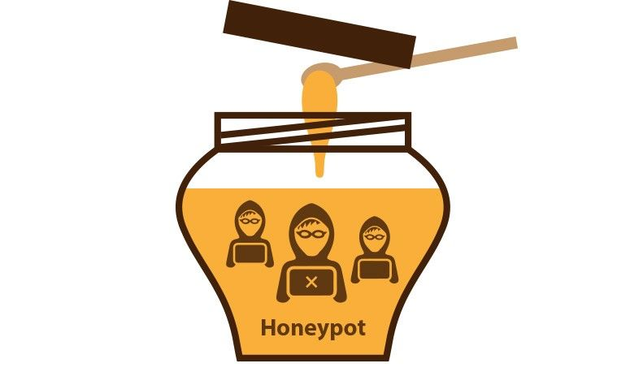
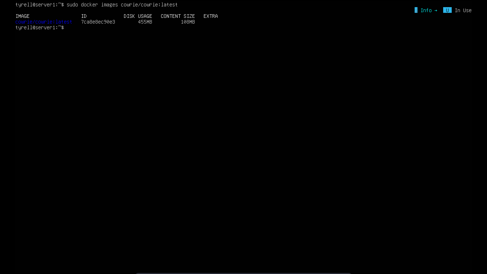
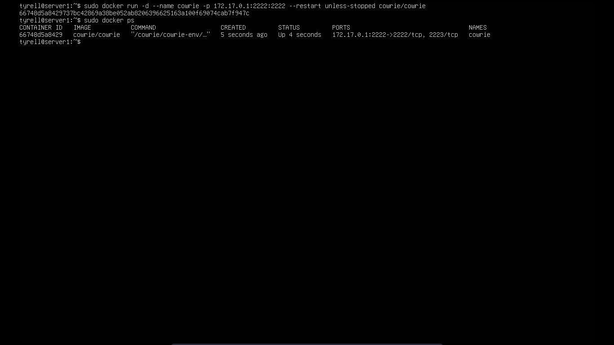

# Deploying Cowrie Honeypot

<p align='center'>
  
</p>

Salah satu metode yang digunakan untuk mengecoh dan menganalisis perilaku penyerang adalah menerapkan honeypot pada sistem. Cowrie merupakan open-source honeypot berbasis SSH dan Telnet yang dirancang untuk mengecoh, menangkap, dan merekam aktivitas penyerang dalam sistem. Seluruh aktivitas yang dilakukan oleh penyerang, seperti percobaan login, perintah yang dijalankan, hingga file yang diunduh, akan direkam untuk keperluan analisis. Dengan demikian, penggunaan honeypot Cowrie dapat menjadi alat yang efektif dalam mempelajari ancaman keamanan jaringan serta meningkatkan strategi pertahanan sistem di masa mendatang.

## Deploy cowrie dengan docker

Disini saya akan menerapkan cowrie menggunakan docker. Dengan docker kita hanya perlu mengunduh image yang sudah dibuat lalu menjalankan cowrie pada sistem lokal. Saya akan mencoba konfigurasi ssh agar semua traffic selain dari interface VPN yang sudah ditentukan akan dialihkan menuju cowrie tanpa memindahkan port default SSH itu sendiri dengan menggunakan IPtables.

- Pull image cowrie dari docker hub

```bash
sudo docker pull cowrie/cowrie:latest
```
- Jika telah selesai cek apakah image cowrie telah ada di docker lokal

```bash
sudo docker images
```


- Jika ada lanjut jalankan cowrie dengan docker, disini kita tidak akan mempublish port docker ke interface host, karena tujuannya mengecoh penyerang maka kita akan tetap menggunakan port 22 SSH namun selain koneksi yang masuk dari interface wg0 (wireguard VPN) maka akan dialihkan ke honeypot.

```bash
sudo docker run -d --name cowrie -p 172.17.0.1:2222:2222 --restart unless-stopped cowrie/cowrie

penjelasan:

-d        : jalankan docker di background 
--name    : beri nama container cowrie
-p        : 172.17.0.1 adalah interface virtual (docker0) yang dibuat oleh docker bisa dicek dengan perintah ip a. 2222:2222 untuk publish port 2222 container ke port 2222 interface docker0
--restart : unless-stopped jalankan otomatis container setelah docker reboot 
```
- Untuk memastikan container sudah jalan dengan benar cek dengan perintah

```bash
sudo docker ps
```


- Setelah coba akses ssh cowrie untuk memastikan sudah berjalan dengan benar. untuk usernya root dan password bisa diisikan bebas

```bash
ssh -p 2222 root@172.17.0.1
```
- jika berhasil login maka container cowrie sudah berjalan dengan benar. Sekarang tinggal konfigurasi iptables agar setiap akses diluar VPN dialihkan ke honeypot 
eluruh aktivitas yang dilakukan oleh penyerang, seperti percobaan login, perintah yang dijalankan, hingga file yang diunduh, akan direkam untuk keperluan analisis.

## Konfigurasi custom

- Secara default hostname pada cowrie adalah srv04 dengan user root atau phil dan password yang dapat diisi kosong, jika belum dikonfigurasi maka ini akan sangat mencurigakan dan mudah sekali dikenali sebagai honeypot, untuk itu maka diperlukan konfigurasi tambahan yang menyesuaikan dengan environment server.

- Pertama kita harus mengcopy konfigurasi dari dalam container ke folder lokal.

```bash
sudo docker cp cowrie:cowrie/cowrie-git/etc .   
```
- Lalu ubah nama folder cowrie.cfg.dist dan userdb.example menjadi cowrie.cfg dan userdb.txt

```bash
sudo mv etc/cowrie.conf.dist etc/cowrie.cfg
sudo mv etc/userdb.example etc/userdb.txt
```
- Jika sudah maka ubah konfigurasi utama pada cowrie.cfg dan konfigurasi user pada file userdb.txt, disarankan mengubah semirip mungkin sesuai dengan lingkungan sistem kita untuk mengecoh dan membuat attacker yakin sudah login pada mesin asli.

- Setelah itu mount konfigurasi custom ini saat menjalankan container cowrie

```bash
sudo docker run -d --name cowrie -p 172.17.0.1:2222:2222 --mount type=bind,source=./etc,target=/cowrie/cowrie-git/etc --restart unless-stopped cowrie/cowrie
```
- Cek dengan login menggunakan konfigurasi yang sudah dibuat, jika dapat login maka konfigurasi sudah berhasil diterapkan

## Membuat rule IPtables

- Terakhir buat rule iptables, yang bisa mengakses SSH pada port 22 hanya interface wg0 yaitu VPN wireguard, sementara selain itu maka akan dialihkan ke port 127.17.0.1:2222 yaitu interface docker0 dan cowrie

```bash
sudo iptables -A INPUT -p tcp ! -i wg0 --dport 22 -j DROP
sudo iptables -t nat -A PREROUTING -p tcp ! -i wg- --dport 22 -j DNAT --to-destination 172.17.0.1:2222
```
- Dengan ini hanya pengguna dengan akses VPN yang dapat login ke SSH asli, sementara sisanya akan dialihkan ke cowrie. PENTING !!! selalu disable login SSH menggunakan password, ini adalah teknik terbaik untuk pencegahan bruteforce attack pada SSH, jika terpaksa maka selalu aktifkn fail2ban dengan batas login 3-5 kali.
