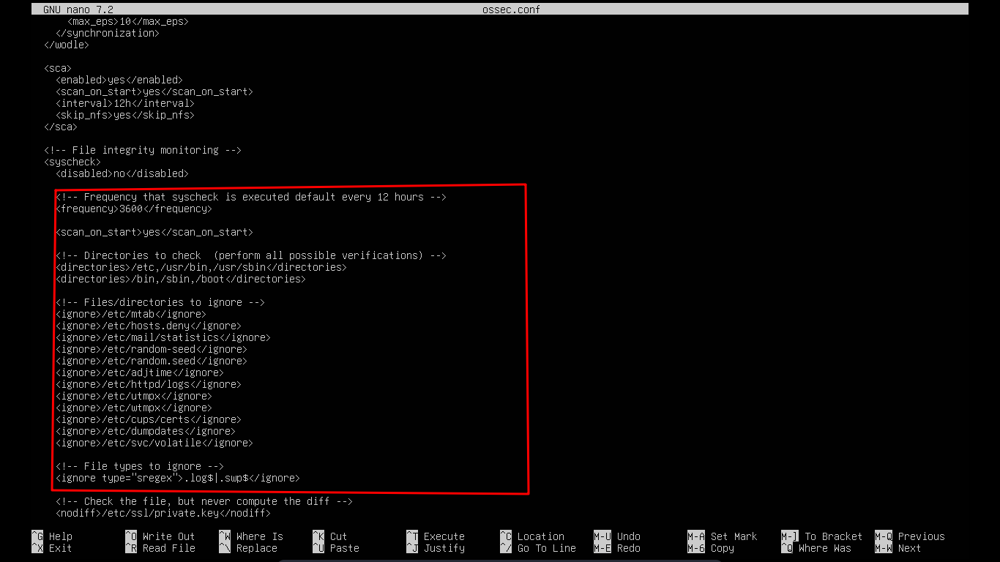

# File Integrity Monitoring

File integrity monitoring (FIM) merupakan salah satu fitur dalam wazuh yang berfungsi untuk mendeteksi dan memberikan alert ketika ada perubahan file yang dilakukan pada endpoint seperti modifikasi, penghapusan, atau penambahan file baru. Dengan FIM kita dapat mengidentifikasi aktivitas yang mencurigakan, mendeteksi potensi serangan serta memastikan kepatuhan terhadap kebijakan keamanan dan standar regulasi yang berlaku.

## Konfigurasi Dan Test Alert Pada FIM

Untuk FIM kita perlu mengkonfigurasi **ossec.conf** pada wazuh-agent, kita dapat menyesuaikan interval waktu, direktori yang harus di cek dan direktori yang diabaikan. Defaultnya wazuh akan mengecek direktori sensitif seperti **/bin, /sbin, /etc, dan /boot** dan mengabaikan direktori yang sering berubah-ubah seperti **/var, /home, dan /dev**.

- Bukan navigation bar dan FIM ada pada tab **Endpoint Security** 

 
- Pada dashboard wazuh kita dapat melihat perubahan atau aktifitas yang terjadi pada file di tab FIM, laporan terbaru akan muncul tergantung konfigurasi interval yang di set pada wazuh-agent. Interval tadi sudah saya set menjadi 20 detik sekali sehingga bisa memunculkan alert lebih cepat, Saya akan mencoba mengubah file **/etc/hosts** untuk mentrigger alert pada wazuh. Perlu diketahui wazuh menggunakan integrity-checksum dengan patokan pada hash file, dan hash sangat sensitif terhadap perubahan walaupun hanya satu bit.

- Dapat dilihat pada dashboard FIM wazuh di tab events muncul sebuah alert dengan tabel syscheck.path berisi /etc/hosts ini menandakan ada perubahan pada file hosts dalam direktori /etc.

- Kita dapat melihat lebih detail dengan inspect pada alert tersebut, disini dapat dilihat hash md5, sha1, dan sha256 pada file **hosts** telah berubah.

- Selanjutnya dapat dilkaukan deep analysis oleh tim keamanan untuk memastikan file yang berubah bukan false positive dan mencari tanda tanda Indicator of Compromise (IoC) pada sistem / endpoint yang di monitor.

## Kesimpulan 

File Integrity Monitoring (FIM) pada wazuh merupakan fitur yang sangat berguna. Tim keamanan dapat dengan mudah mencari akar penyebab masalah dan mengumpulkan bukti bukti sebagai indikator apakah telah terjadi kompromi pada sistem atau hanya sebuah false positive belaka. Dengan ini integritas dalam sistem dapat dipenuhi dan monitor secara berkala.
