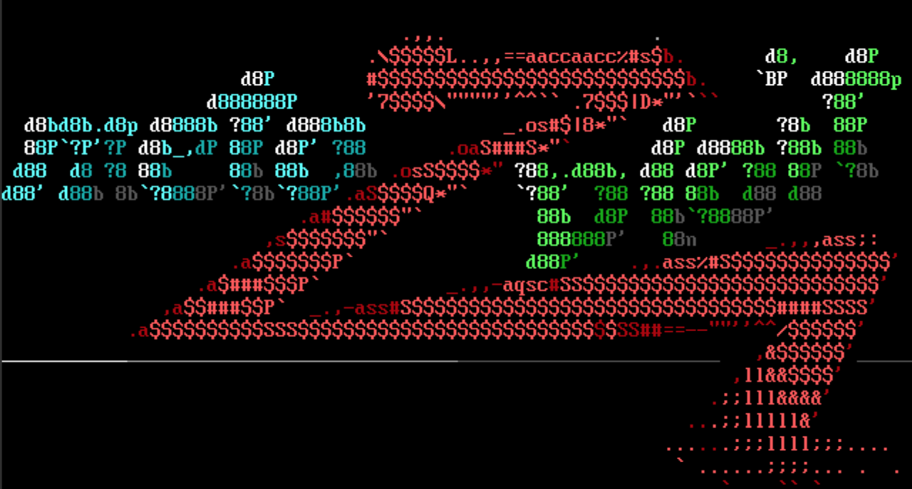

# Metasploit Framework 

  

Metasploit merupakan framework penetration testing yang sangat terkenal dan banyak digunakan oleh amatir hingga profesional di bidang cybersecurity. Karena sifatnya yang open-source dan komunitas yang luas menjadikan metasploit tools yang paling sering digunakan saat ingin melakukan penetration testing. Dengan kumpulan modul yang luas termasuk exploit,payload,auxiliary dan post-exploit serta banyaknya dokumentasi yang bertebaran di internet semakin menambah popularitas tools ini. banyak organisasi dan komunitas yang mengadopsi dan terus mengembangkan framework ini, sehingga menjadikannya terus update dan masih relate digunakan hingga saat ini.
