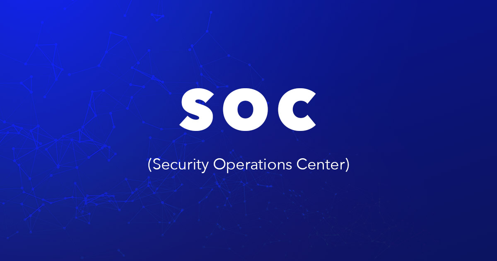

# SOC

  

Security operations center atau sering disingkat SOC adalah pusat operasi keamanan tempat tim siber sebuah organisasi memantau, menganalisis, dan merespons insiden kemanan di jaringan, sistem, dan aplikasi organisasi.

Biasanya di dalam SOC dibagi menjadi 3 level/layer dengan keahlian dan bidang tertentu tergantung kebijakan organisai tersebut namun jika secara umum bisa dikategorikan sebagai berikut:

- L1 > Monitoring & Triage: melakukan monitor log dan alert Seperti SIEM, IDS, EDR/XDR untuk mendeteksi ancaman dan melakukan triase alert. Menjadi garis depan dalam SOC dan deteksi awal ancaman, Melakukan eskalasi ke L2 jika diperlukan
    
- L2 > Incident Respone & Deep Analysis: Melanjutkan investigasi dari L1 (root cause analysis) dengan deep analysis dan investigasi insiden yang telah dikonfirmasi
 
- L3 > Threat Hunting & Forensics: Investigasi mendalam dan pengembangan deteksi. Threat hunter proaktif mencari tanda serangan sebelum terjadi dan digital forensik untuk mendalami dan mencari bukti insiden pada sistem

SOC adalah garda terdepan dalam mendeteksi, menemukan, menganalisa dan mencegah kompromi yang dapat mengancam sistem bahkan sebelum ancaman itu benar benar menyerang. oleh karena itu SOC menjadi komponen wajib sebuah organisasi di era yang serba digital ini.

## Project

| Project | Deskripsi
|----------|------------|
| [Incident Response Flow](Incident-Response-Flow) | Memahami alur incident response mulai dari pra-insiden hingga pasca-insiden 
| [Wazuh Implementation](Wazuh-Implementation) | Mengimplementasikan wazuh sebagai SIEM pada lingkungan virtualisasi
| [Deploying Cowrie Honeypot](Deploying-Cowrie-Honeypot) | Memasang cowrie sebagai honeypot pada server untuk mengecoh dan menganalisis perilaku penyerang 
| [Linux System Hardening](Linux-System-Hardening) | Melakukan konfigurasi (Hardening) pada server Linux Ubuntu
