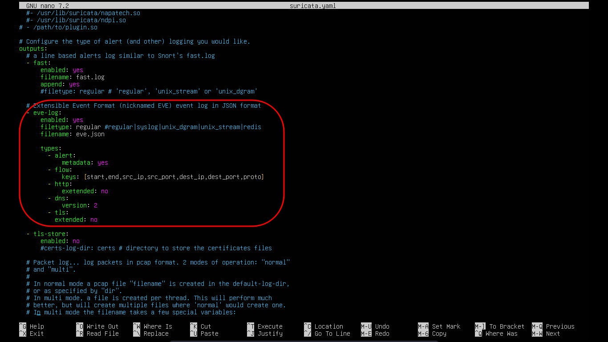

# Wazuh and suricata integration

<p align="center">
  
</p>

Suricata merupakan IDS (intrusion detection system) yang dikembangkan OISF. Dirancang untuk mendeteksi ancaman secara real-time yang dapat menganalisis lalu lintas jaringan dengan kecepatan tinggi berkat sistem multi-threading nya. Suricata banyak digunakan di organisasi dan industri saat ini, dengan basis open source dan mudah diintegrasikan dengan tools lain seperti SIEM menjadikan suricata banyak digemari di kalangan blue team.

## Integrasi dengan wazuh

Mengintegrasikan suricata dengan wazuh bertujuan untuk membangun sistem deteksi ancaman yang lebih komprehensif dengan menggabungkan kemampuan Intrusion detection system (IDS) dari suricata dan Security information and event management (SIEM) milik wazuh. mengintegrasikan suricata dengan wazuh terbilang cukup mudah dilakukan karena memang keduanya sudah mendukung environment masing masing.

## Langkah-langkah

1. Menginstall suricata pada mesin yang akan dijadikan sebagai IDS di sini saya gabungkan dengan agent wazuh karena saya hanya menggunakan dua mesin 
```bash
sudo apt install suricata -y
```
2. Biasanya akan ada tampilan untuk setup jaringan yang ingin dipantau atau bisa kita set di */etc/suricata/suricata.yaml*

3. Pada bagian HOME_NET baris pertama bisa di setting dan disesuaikan dengan jaringan yang ingin dipantau oleh suricata
```bash
vars:
  # more specific is better for alert accuracy and performance
  address-groups:
    HOME_NET: "[192.168.0.0/16,10.0.0.0/8,172.16.0.0/12]"
    #HOME_NET: "[192.168.0.0/16]"
    #HOME_NET: "[10.0.0.0/8]"
    #HOME_NET: "[172.16.0.0/12]"
    #HOME_NET: "any"
```

4. Setelah itu selesai penginstallan dan setting suricata lanjut ke setup wazuh-agent agar dapat memantau log yang dihasilkan suricata

5. Masuk ke */var/ossec/etc/ossec.conf* pada wazuh-agent dan tambahkan baris baru di dalam tag <ossec_config> paling bawah, penting!!! suricata menghasilkan dua log di */var/log/suricata/* yaitu *eve.json* dan *fast.log*. Perbedaan keduanya adalah pada informasi yang diberikan, *fast.log* hanya memberikan informasi ringkas seputar alert yang dimunculkan, sementara *eve.json* memberikan informasi lebih detail terkait alert sehingga biasanya yang digunakan adalah *eve.json* 
```bash
<ossec_config>

  <local_file>
    <log_format>json</log-format>
    <location>/var/log/eve.json</location> # arahkan ke path log suricata 
  </local_file>
  
</ossec_config>
```
6. Restart wazuh-agent
```bash
sudo systemctl restart wazuh-agent
```
7. Setelah itu bisa tes alert dengan command dan lihat pada dashboard wazuh alert yang muncul dari suricata
```bash
curl https://testmynids.org/uid.index.html
```
## Troubleshooting Suricata

Banyak masalah yang dikeluhkan terkait alert suricata yang tidak muncul pada dashboard wazuh. Perlu dipahami pada suricata versi terbaru field yang dihasilkan pada *eve.json* sangat banyak dan bertele-tele ini menyebabakan json-decoder pada wazuh kewalahan dan tidak dapat menanganinya,bisanya akan ada peringatan pada ossec.log di wazuh-server seperti: *to many fields for json-decoder* hal ini dapat diatasi dengan beberapa cara namun yang paling efektif adalah dengan mengurangi dan menyortir jumlah field pada suricata agar tidak terlalu banyak tapi tidak membuang field penting

1. edit */etc/suricata/suricata.yaml* pada bagian eve-log isi seperti pada gambar, Ini akan meminimalkan field yang dihasilkan tanpa membuang field penting yang dibutuhkan oleh wazuh



2. Save dan restart suricata

2. Setelah itu cek apakah masih ada peringatan pada *ossec.log* di wazuh server, jika tidak coba trigger alert pada suricata dan cek apakah log masuk ke dashboard.


 

