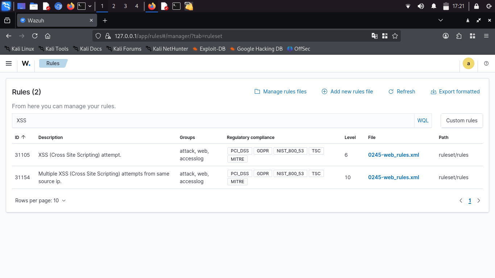
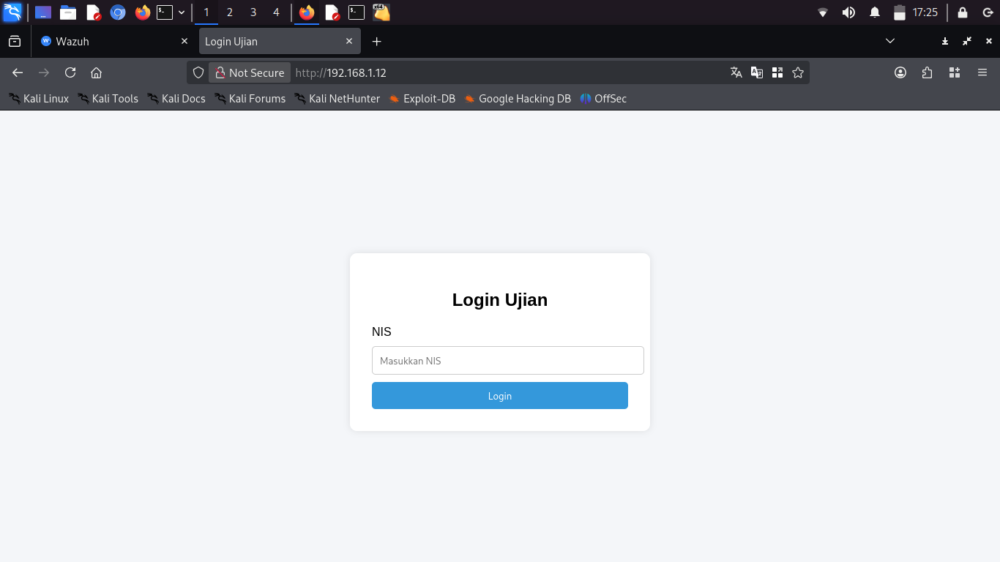
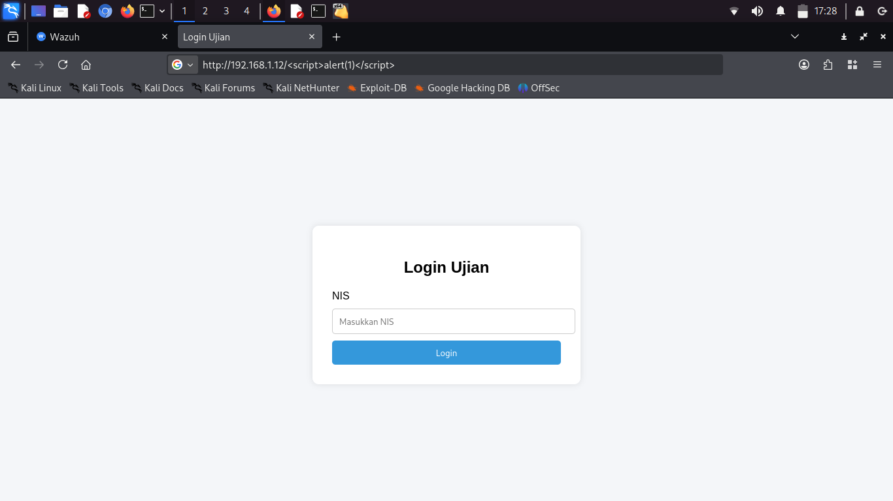
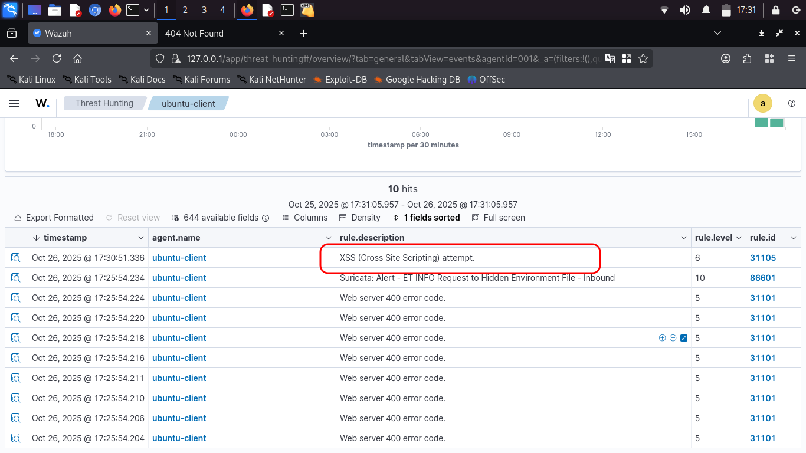
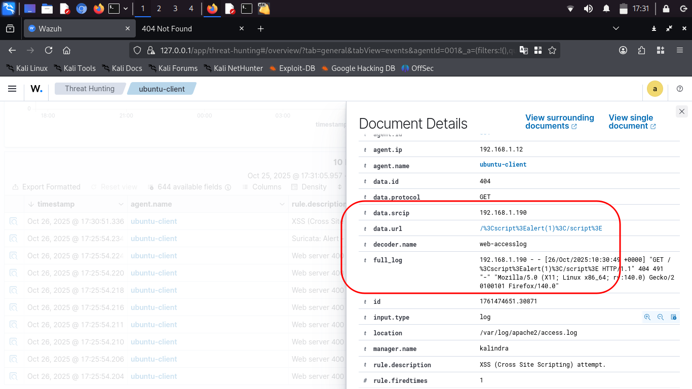
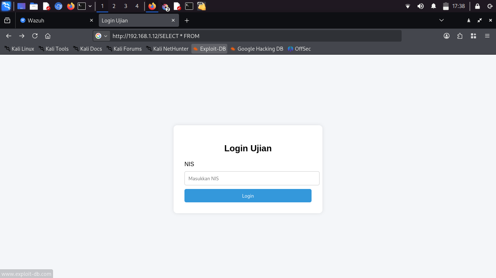
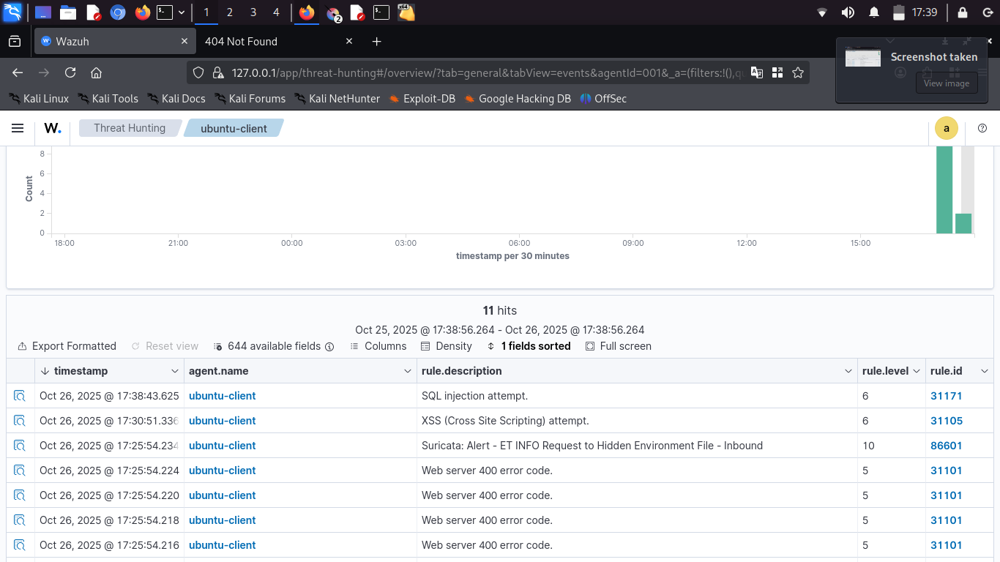

# XSS and SQLI detection with wazuh

Wazuh sebagai SIEM akan mengumpulkan berbagai macam log termasuk dari service seperti nginx atau apache dan mencari serta mencocokan signature tertentu berdasarkan rules. Oleh karena itu wazuh dapat mendeteksi percobaan cross site scripting (xss) dan sql injection (sqli) pada web berdasarkan rules yang telah dibuat. hal ini sangat berguna bagi tim SOC untuk mengambil tindakan cepat dan mengevaluasi keamanan web. 

## Deteksi XSS dan SQLi

Pada dasarnya wazuh telah mempunyai rules default untuk mendeteksi payload berbahaya yang dimasukan attacker seperti xss dan sqli serta serangan pada web lainnya, namun ketika penginstallan pertama wazuh biasanya alert yang muncul hanya yang berlevel 7 atau lebih karena konfigurasi bawaan pada *ossec.conf*, sementara rules xss dan sqli mempunyai level 6 by default. Jadi kita harus menurunkan batas level untuk memunculkan alert atau menaikan level rules xss dan sqli itu sendiri.

- Saya sudah membuat page sederhana untuk dijadikan target serangan

- Saya akan mencoba payload sederhana yang biasa digunakan untuk tes xss pada website.

- Setelah saya submit maka akan muncul alert di dashboard wazuh, kita dapat melihat detail payload apa yang dimasukan attacker dengan inspect log

- Bisa dilihat pada dashboard wazuh muncul alert xss attempt dengan level 6, dan jika di inspect kita dapat melihat detail ip sumber dan payload apa yang dimasukan oleh attacker, untuk sqli sama seperti xss kita akan mendapat alert dan detail payload yang dimasukan attacker

- Saya akan mencoba memasukan payload sqli 

- Dan payload nya pun mentrigger alert pada dashboard wazuh dengan level 6, juga kita dapat melihat detail sumber ip attacker dan payload apa yang dimasukan

## Kesimpulan

Wazuh bertindak sebagai SIEM yang mana dapat mengumpulkan macam-macam log dari berbagai service. Namun perlu diingat wazuh hanyalah alat yang bekerja berdasarkan rules yang cocok dengan pola dan payload attacker. Dan kemampuan wazuh hanya sekedar mendeteksi dan memunculkan alert ketika telah terjadi serangan. Jadi diperlukan sistem keamanan lain seperti Web application firewall sebagai pencegahan awal agar payload tidak masuk dan di eksekusi oleh server.
  
