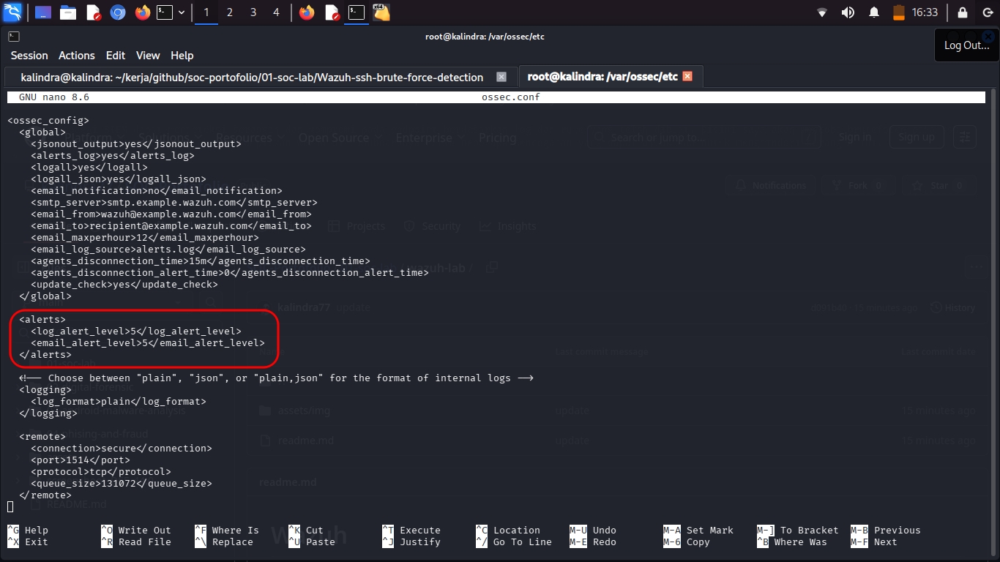
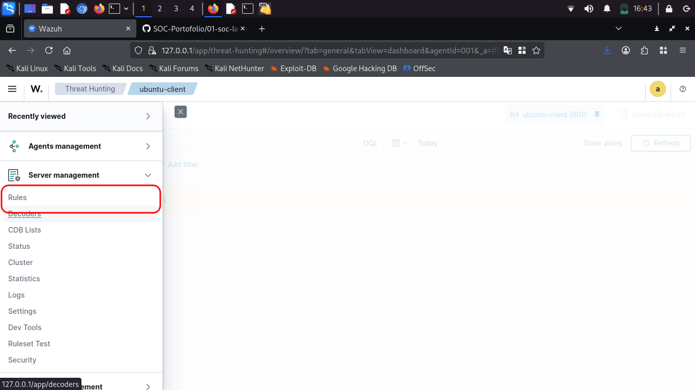
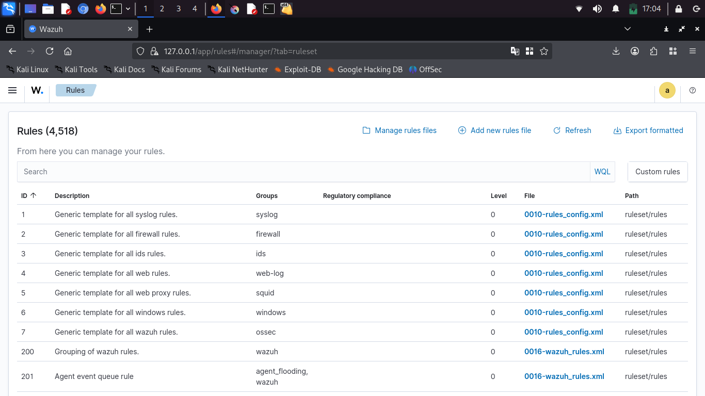
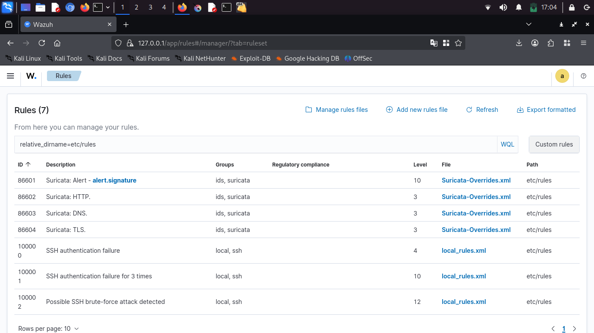
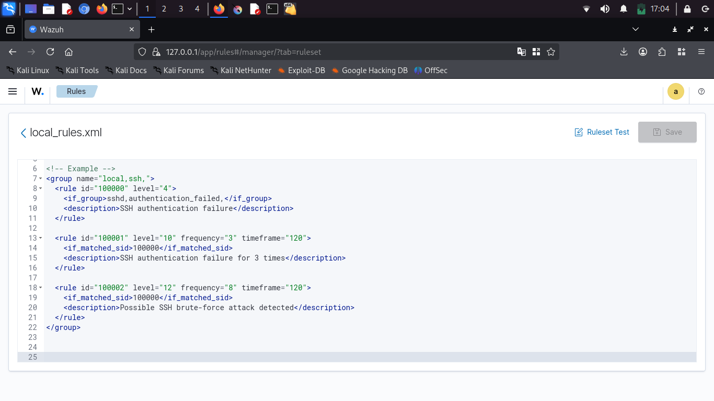

# Setup custom rules 

Pada dasarnya wazuh sudah memiliki banyak rules default yang siap digunakan, namun untuk mengoptimalkan performa wazuh kita harus menyesuaikan rules dengan kebutuhan untuk meminimalkan false-positive dan mempermudah monitoring.

## Setup rules wazuh

- Pertama atur konfigurasi ossec di */var/ossec/etc/ossec.conf* pada wazuh-server, lihat pada bagian tag <alerts> disitu ada <log_alert_level> ini adalah batas dimana jika alert sama atau lebih dari level 5 maka akan dimuculkan di dashboard sementara dibawah itu maka akan di suppress atau tidak dimunculkan namun tetap bisa digunakan sebagai dasar bagi alert lain misal dengan frequency 5 kali di trigger maka akan memunculkan alert, jadi sesuaikan tergantung kebutuhan.

- Konfigurasi rules bisa melalui terminal(CLI) maupun melalui GUI di dashboard wazuh. Di gui ada di server management di bagian rules

- Disini banyak rules default yang tersedia. pilih costum-rules di pojok kanan atas untuk menambahkan rules kustom

- Pilih local-rules.xml atau bisa juga buat file baru  

- Isi custom rules dengan format xml sesuai dokumentasi resmi dari wazuh yang dapat dilihat di laman resminya ataupun melalui artikel dan komunitas-komunitas yang sudah banyak di internet

## Penting

Wazuh memang memiliki banyak rules default bawaan, namun membuat custom rules sesuai dengan kebutuhan organisasi sangat penting untuk meminimalkan false positive dan mempermudah monitoring. SIEM tuning harus dilakukan berkala dan terjadwal misal seminggu sekali atau dua minggu sekali, dikarenakan ancaman yang terus berubah seiring waktu
