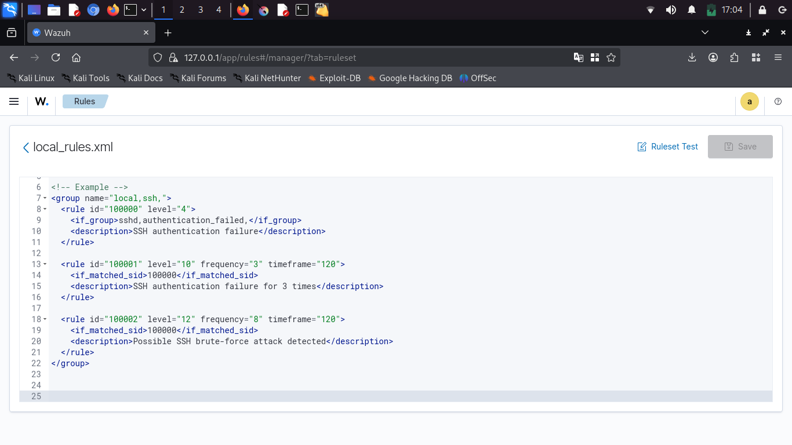
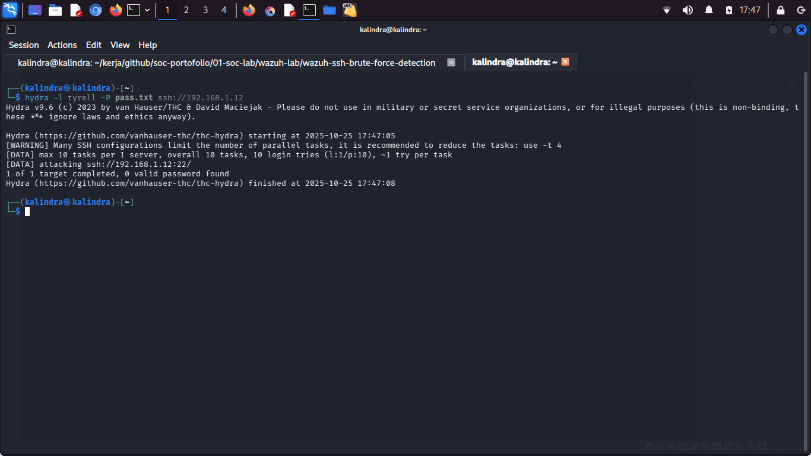
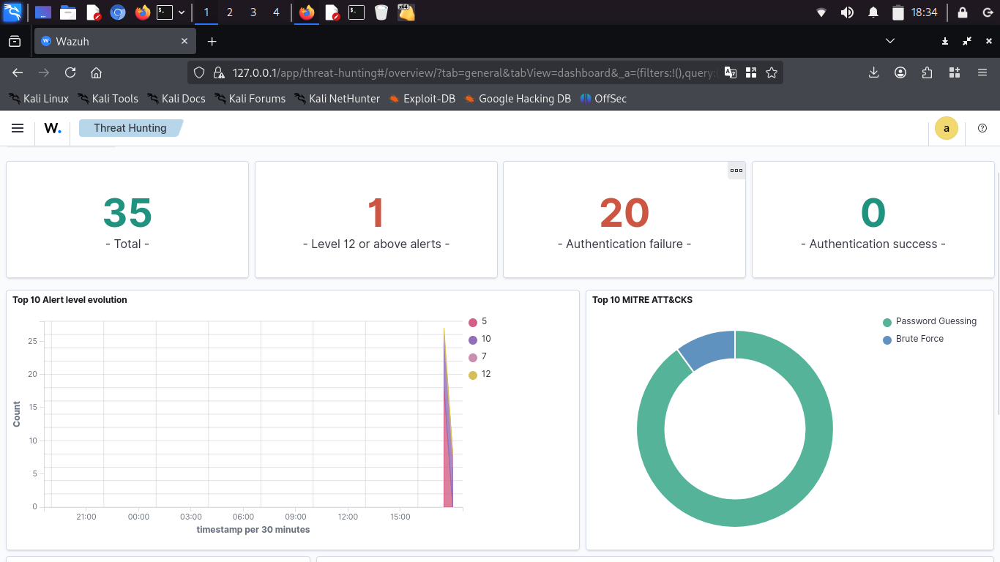
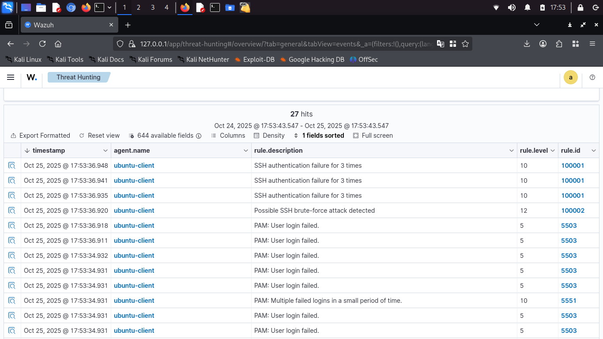
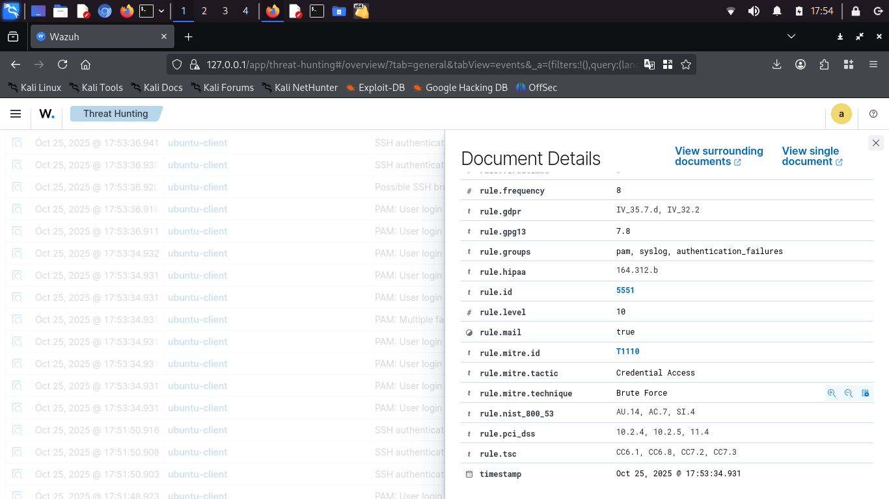

# SSH brute force detection using wazuh

Wazuh sebagai SIEM dapat mendeteksi serangan dan kompromi pada endpoint berdasarkan log dan rule yang telah dibuat. Disini saya akan mencoba bruteforce pada ssh endpoint dan melihat apa yang akan ditampilkan wazuh di dashboardnya serta beberapa pencegahan yang dapat dilakukan untuk menghindari serangan ini.

## Brute-force ssh

- Saya menambahkan rules custom seperti pada gambar agar lebih mudah mengenali alert

- Saya menggunakan tools Hydra untuk mencoba brute-force

- Pada tab Dashboard di threat hunting wazuh sudah mendeteksi bruteforce yang pada endpoint ubuntu-client

- Dan pada tab event sudah muncul alert custom *Possible ssh brute force attack* dengan level 12 dan beberapa alert bawaan *multiple failed logins in small period of time* dengan level 10
 

- jika dilihat detail dengan inspect log, terdapat rule mitre lengkap dengan id,taktik dan teknik yang digunakan. Selain itu ada juga dari NIST, PCI dss, dan Tsc. Ini dapat memudahkan untuk mapping serangan dan mempercepat respon serta penanggulangan.

## Pencegahan dan kesimpulan

Wazuh dapat mendeteksi serangan bruteforce pada endpoint namun, wazuh saja tidak cukup karena pada dasarnya hanya merupakan SIEM bukan sebgai pervention. Ada beberapa cara yang dapat diterapkan, diantaranya:

1. Gunakan fail2ban sebagai pencegah bruteforce, tools ini sangat efektif untuk memblokir IP yang gagal melakukan login secara berulang sesuai rules ditentukan.
2. Batasi akses penting seperti ssh dan ftp dengan vpn internal. Ini merupakan cara yang efektif dan banyak diterapkan pada organisasi dan industri di dunia.
3. Non aktifkan login menggunakan password dan gunakan public key infrastucture, Dengan ini akses bruteforce attacker terblokir penuh karena tidak dapat menebak password
4. Pasang honeypot jika diperlukan. Ini merupakan opsional, namun dapat digunakan untuk menganalisa perilaku attacker dan mempelajari untuk digunakan sebagai bahan penguatan sistem keamanan organisai.

