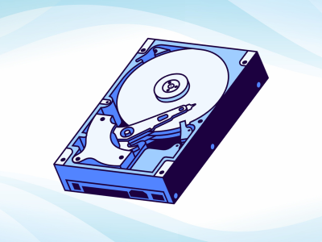

# Disk Forensic

  

Disk forensic merupakan salah satu bidang dalam digital forensik dengan fokus mengidentifikasi, mengumpulkan, menganalisis, dan menjaga bukti digital pada media penyimpanan non-volatil seperti HDD, SSD, Flashdisk, atau SDcard

## Apa yang dilakukan dalam disk forensic ?

1. Akuisisi Image -> Membuat salinan bit-by-bit yang sama persis tanpa mengubah media asli.
2. Verifikasi Integritas -> Menggunakan metode hashing untuk integritas bukti dan memastikan data tidak berubah saat proses akuisisi
3. Analisis File System -> Menganalisis strukutr file system (NTFS, FAT, ext4, dll), untuk melihat file aktif, metadata, dan memetakan struktur direktori dalam disk
4. Recovery File Terhapus -> Mengembalikan atau memulihkan file yang terhapus dengan metode analisis file system atau file carving.
5. Mencari Artifak -> Mencari jejak aktivitas yang masih tersisa seperti log, browser history, email, password, dll
6. Analisa Timeline -> Menyusun timeline berdasarkan timestamp artifak
7. Reporting -> Menyusun laporan akhir forensik

*Contoh Kasus:*

- Menyelidiki kasus pencurian data pada perusahaan
- Mencari jejak peretas dalam sistem
- Mengembalikan data penting yang sengaja dihapus

  

 
