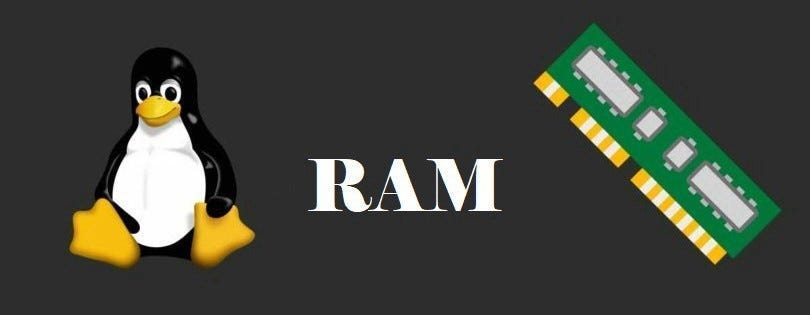

# Linux Memory Extraction (LiME)

<p align="center">

</p>

Kali ini saya akan mencoba mengekstraksi memory (RAM) pada linux menggunakan LiME. LiME adalah kernel modul linux yang digunakan untuk mengekstraksi memory (RAM) secara langsung saat komputer menyala. Sedikit pendahuluan, pada digital forensik khususnya disk & memory forensic ada dua jenis data yaitu volatile (sementara/berubah-ubah) dan non-volatile (tetap). Memory (RAM) termasuk kedalam data yang volatile artinya data dalam memory bersifat sementara waktu yang mana dalam konteks ini memory dapat kehilangan data saat komputer dimatikan atau diputus dari aliran listrik. Oleh karena itu, Memory hanya dapat diambil saat komputer menyala atau sedang dijalankan. Dalam digital forensik memory memiliki keunggulannya sendiri dibanding media lain, saat komputer sedang berjalan semua proses dan data sementara disimpan dalam memory (RAM) agar lebih cepat saat diakses, Hal ini yang dimaanfaatkan dalam digital forensik karena memory otomatis menyimpan proses atau data yang tidak dapat ditemukan dalam media lain seperti aplikasi yang sedang berjalan, Info registry, perintah yang dijalankan, Kredensial yang disimpan dalam Ram, dan masih banyak lagi data yang dapat ditemukan dalam memory (RAM).

## Ekstraksi Memory

Untuk mengekstraksi memory di linux kita memerlukan kernel modul bernama Lime yang dapat diunduh pada repositry ini https://github.com/504ensicsLabs/LiME
```bash
git clone https://github.com/s04ensicsLabs/LiME
```
Setelah selesai, masuk ke directori LiME/src/ lalu jalankan perintah **make**. Perintah ini akan membuat sebuah file modul kernel yang nantinya digunakan untuk mengekstraksi memory.

```bash
cd LiME/src
make
```
setelah proses selesai maka akan muncul sebuah file modul kernel yang berekstensi ko. ini merupakan hasil compile dari LiME sesuai dengan kernel kita.

Selanjutnya kita hanya perlu insert modul kedalam kernel dan LiME akan otomatis mengakuisisi memory

```bash
sudo insmod <file.ko> path=<target_path> format=<format>
```
Ganti <file.ko> dengan hasil compile tadi, isi path dengan folder serta output kita, dan format dengan raw atau lime. waktu yang dibutuhkan tergantung size memory yang diakuisi.

**raw** : dump persis seperti isi ram byte by byte tanpa metadata

**lime** : format lime sendiri, ada sedikit metadata tambahan untuk memudahkan proses forensik 

