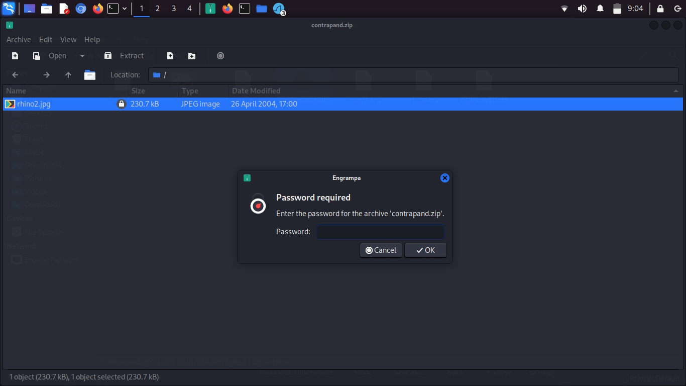
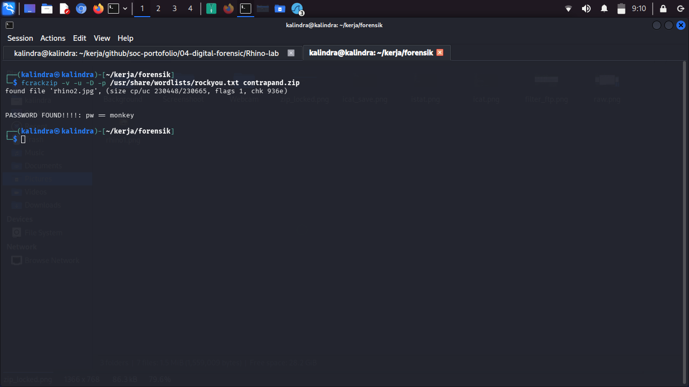
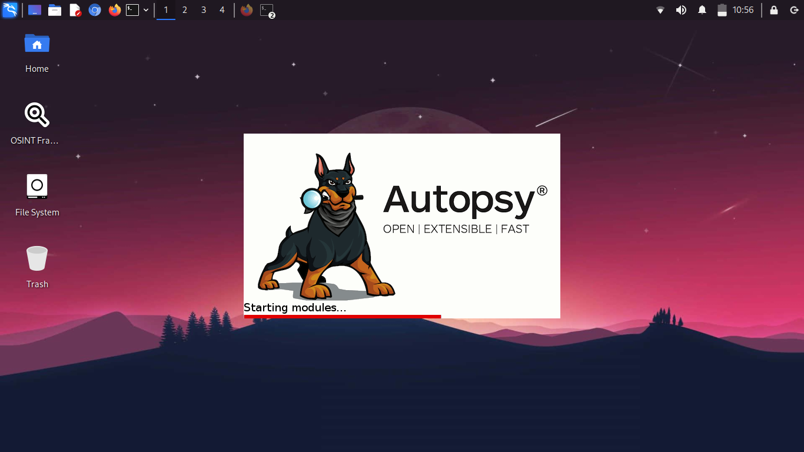
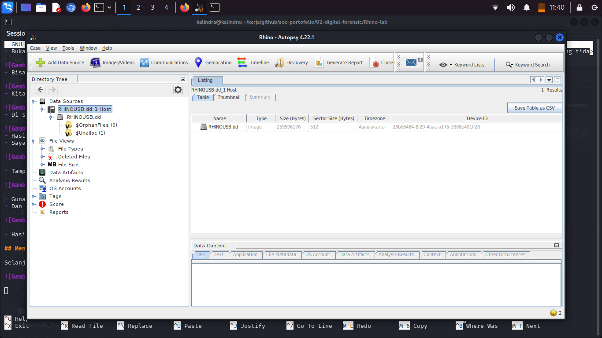
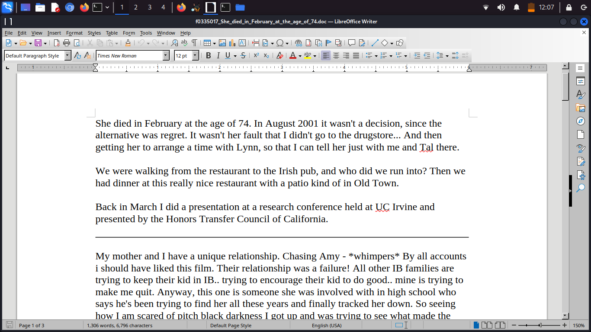

# Rhino Scenario

Disini saya menggunakan skenario rhino yang mana kita diberi tugas menganalisa dan mencari jejak pada file hasil dump yang telah diberikan untuk mengungkap sebuah kasus 

Tugasnya adalah memulihkan setidaknya sembilan gambar badak dari bukti yang tersedia dan memasukkannya ke dalam laporan singkat

• Siapa yang memberi tersangka akun telnet/ftp?

• Apa nama pengguna/kata sandi untuk akun tersebut?

• Transfer berkas relevan apa yang muncul dalam jejak jaringan?

• Apa yang terjadi pada hard drive di komputer? Di mana sekarang?

• Apa yang terjadi pada key USB?

• Apa yang dapat dipulihkan dari image dd USB?

Apakah ada bukti yang menghubungkan kunci USB dan jejak jaringan? Jika ada, apa?

Saya akan coba menganalisa, mengidentifikasi, dan mencari bukti-bukti pada file RHINOUSB.dd dan traffic jaringan yang sudah ditangkap dalam bentuk bebrapa file log.

Saya Menggunakan tools yaitu autopsy dan the sleuth kit untuk menganalisa file dump usb juga Wireshark dan Bruteforcesharkcli untuk file log jaringannya

## Menganalisa file log network traffic menggunakan Wireshark

- Buka file dengan wireshark lalu gunakan filter **ftp or ftp-data** untuk melihat lalu lintas ftp pada log, dapat dilihat di atas ada user dan password ftp yang tidak terenkripsi pertanyaan username dan password terjawab username: gnome password: gnome123

- Bisa dilihat ada traffic pengiriman data melalui ftp dengan nama file rhino1.jpg, kita bisa merocevery file tersebut dengan melihat raw data nya

- Kita bisa melihat aliran data nya Dengan klik kanan pada log pertama pengriman lalu follow pilih TCP stream untuk melihat aliran data dan isi raw nya

- Di sini jika data berupa ASCII pada kolom show as ubah menjadi RAW lalu klik save as masukan nama file untuk disimpan

- Hasilnya adalah file rhino1 yang berhasil di recover, gambar menunjukan seekor badak di alam liar
- Saya melakukan cara yang sama untuk merecover semua file yang terdapat pada semua log tersebut termasuk file contrapand.zip

- Tampaknya file zip contrapand membutuhkan password untuk diekstraksi, saya akan menggunakan tools fcrackzip untuk membuka password tersebut

- Gunakan perintah **fcrackzip -v -u -D -p /usr/share/wordlists/rockyou.tx contrapand.zip** untuk memecah password dengan wordlists rockyou
- Dan passwordnya adalah: monkey

 

- Hasilnya adalah gambar rhino2.jpg

## Menganalisa image dump dd menggunakan Autopsy

Selanjutnya setelah selesai menganalisa log jaringan saya lanjut denga image dump dd dari usb 

- Hasil dari autopsy menunjukan sebuah file yang mengungkap semuanya 

- Sebuah document berisi tulisan seseorang tentang apa yang terjadi sebenarnya 

## Kesimpulan dan jawaban

Siapa yang memberi terdakwa akun telnet/ftp? Jeremy 

Apa nama pengguna/kata sandi untuk akun tersebut? gnome:gnome123

Transfer berkas relevan apa yang muncul dalam jejak jaringan? beberapa foto badak  

Apa yang terjadi pada hard drive di komputer? Di mana sekarang? Hard drive dicopot dan dibuang ke sungai mississipi

Apa yang terjadi pada USB? tersangka menimpa (wipe) data di usb berharap tidak dapat dipulihkan

Apa yang dapat dipulihkan dari image dd USB? file file yang dihapus dan metadatanya 

