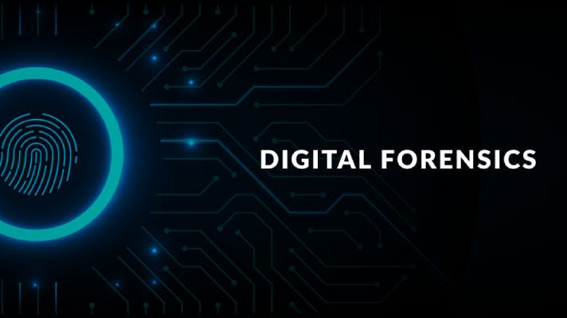

# Digital forensic

  

Digital Forensik adalah cabang ilmu forensik yang fokus pada identifikasi, pengumpulan, analisis, dan pelestarian bukti digital dari perangkat elektronik seperti komputer, smartphone, server, jaringan atau media penyimpanan lainnya.

Secara garis besar digital forensik melibatakan beberapa langkah utama:

1. Identifikasi > Menentukan perangkat atau data yang relevan denga kasus/insiden
2. Pengumpulan  > Mengamankan data tanpa merusaknya biasanya dengan membuat salinan bit by bit
3. Presevasi > Menjaga integritas bukti agar tidak berubah atau hilang, misalnya dengan hashing untuk memastikan keaslian data
4. Analisis > Memeriksa data untuk mengumpulkan bukti aktivitas seperti jejak login, file yang dihapus, malware atau komunikasi mencurigakan
5. Pelaporan > Menyusun laporan formal yang menjelaskan temuan secara jelas dan dapat dipertanggung jawabkan

Digital forensik dalam dunia cybersecurity menjadi salah satu komponen yang sangat penting untuk mendeteksi, menganalisis, dan mengatasi insiden siber. Ketika terjadi pelanggaran atau serangan siber, seperti peretasan, pencurian data, atau penyebaran malware.  
