# Malware undangan pernikahan

Malware ini pasti sudah tidak asing lagi di kalangan para pegiat cybersecurity maupun awam, menyamar dengan nama seperti "undangan pernikahan", "map tempat nikahan", bahkan hingga menggunakan nama orang seperti "undangan kepada Andi" untuk meyakinkan korban, biasanya malware ini berbentuk aplikasi yang disusupi kode jahat. Malware ini bisa mencuri data dari perangkat korban seperti pesan sms, kontak, lokasi, hingga bisa menangkap gambar dari layar maupun kamera lalu mengirimnya ke server c2c pelaku. Biasanya pelaku amatir menargetkan korban secara random melalui media sosial seperti whatsapp, facebook, instagram hingga email, berbeda dengan pelaku profesional yang melakukan riset terlebih dahulu misal melalui teknik osint dan data breach dari sebuah situs atau aplikasi. Ada beberapa ciri red flag yang bisa menjadi indikasi bahwa sebuah aplikasi adalah malware diantaranya:

1. Dikirimi secara random dari orang yang tidak kita kenal ini sudah bisa dipastikan 99% merupakan penipuan dan aplikasinya adalah malware 
2. Mengaku ngaku dari sebuah perusahaaan seperti shopee, lazada, j&t, bahkan dari microsoft namun tidak melalui kontak resmi peruusahaan 
3. Izin (permission) aplikasi yang berlebihan dan tidak seharusnya seperti izin membaca pesan, kamera, kontak dll
4. UI/UX aplikasi yang dipaksakan dan buruk ini menandakan bahwa aplikasi dibuat asal jadi dan dalam waktu singkat
5. Link download yang tidak resmi namun dibuat mirip dan terkesan dipaksakan seperti www.rnicrosoft.com, shooope.cc, gojEk.wizgo.xyz, dll

Disini saya akan melakukan analisis sebuah aplikasi yang didapat dari sebuah grup telegram sehingga kita bisa melihat cara kerja aplikasi seperti ini, Perhatian saya melakukan ini di lab khusus yang terisolasi dan aman sehingga tidak menimbulkan kerusakan.  

## Menganalisis perilaku malware

Saya menggunakan beberapa tools yaitu Android_X86 yang saya install di Virtualbox sebagai virtual machine environment yang terisolasi sehingga tidak merusak host, MOBsf untuk Static dan dynamic analysis, Burpsuite untuk menangkap lalu lintas jaringan yang keluar masuk aplikasi, semua tools ini tersedia secara gratis dan open source 

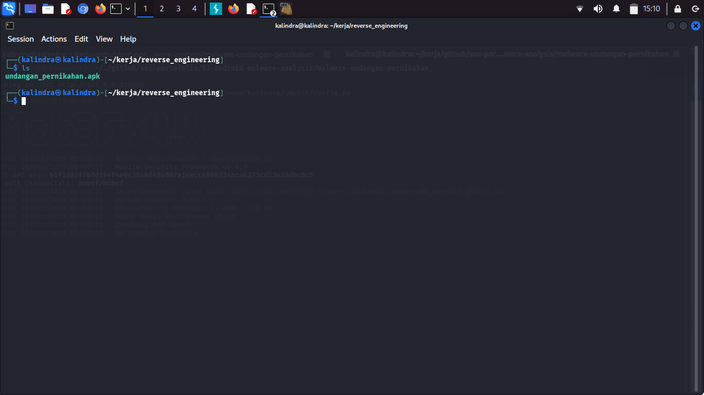
- Saya sudah menyediakan sebuah malware yang saya dapat dari sebuah grup telegram

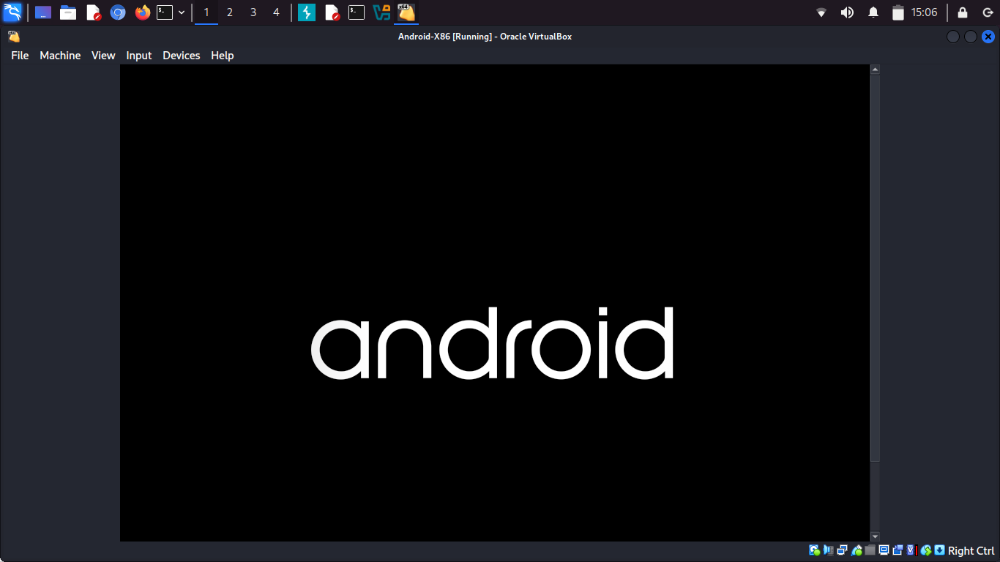
- Jalankan VM android nya 

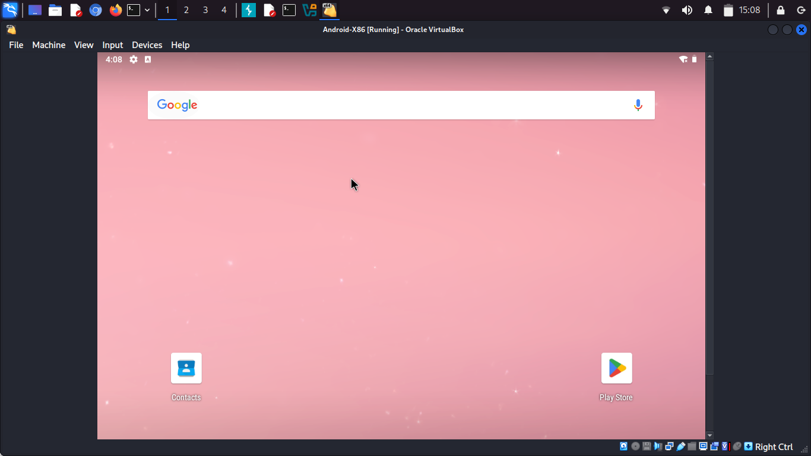
- Tampilan UI android_X86 

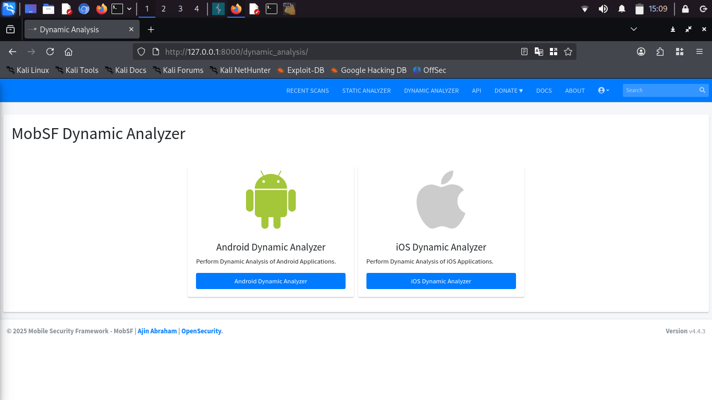
- Masuk ke Mobsf

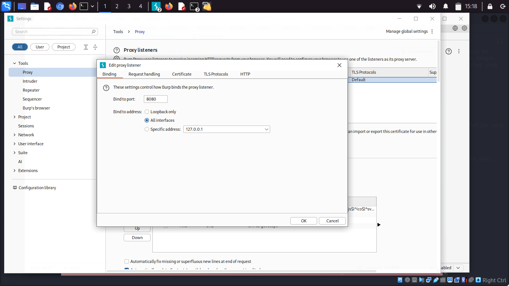
- Interface burpsuite harus di set ke all interface agar dapat menangkap lalu lintas dari VM dan proxy wifi interface di VM harus di set ke interface burpsuite agar dapat tersambung, juga kita butuh menginstall sertifikat burpsuite di Android_X86

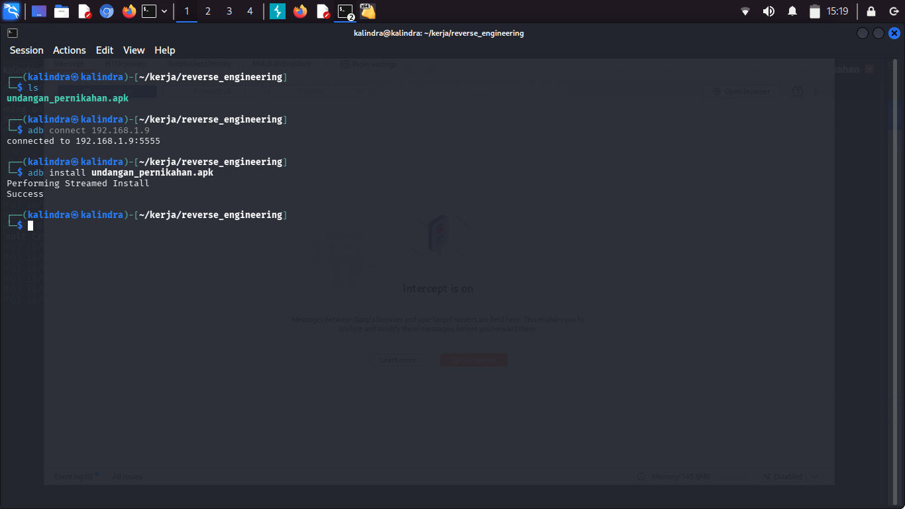
- Connect ADB dengan android VM untuk mengintsall aplikasi via ADB 

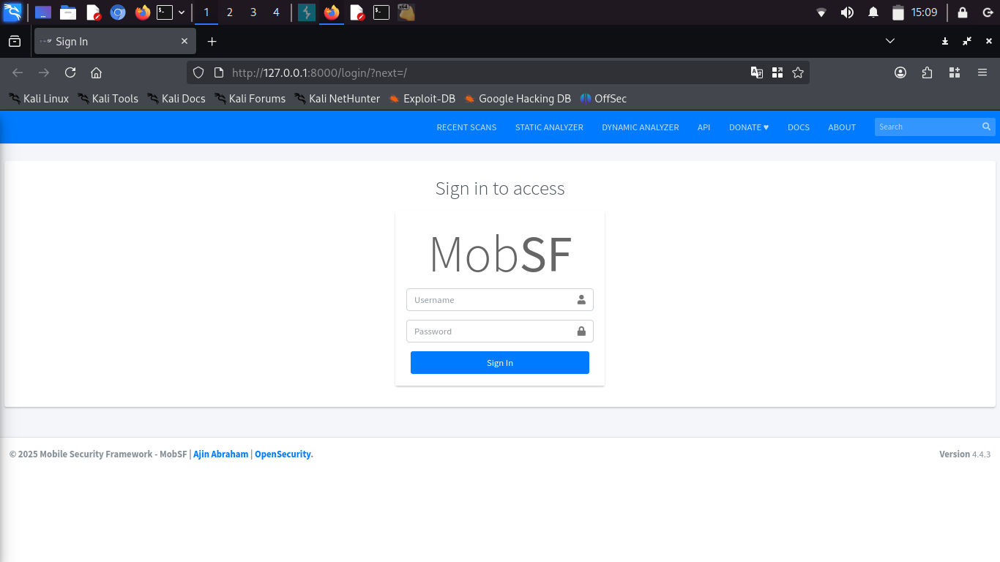

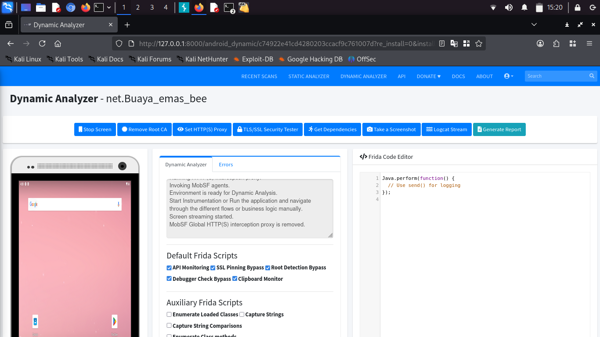
- Saya akan langsung melakukan analisa dinamis untuk melihat perilaku malwarenya, Disclaimer untuk menjalankan beberapa aplikasi di Android-X86 butuh ARM translation layer menggunakan houdini karena beberapa aplikasi tidak mendukung arsitektur X86 dan hanya dibuat untuk arsitektur ARM 

- Dapat dilihat mobsf melakukan bypass ssl pinning dengan menggunakan frida, salah satunya bertujuan agar kita dapat melihat lalu lintas jaringan tanpa error sertifikat yang biasanya terjadi karena proxy yang di set ke interface burpsuite 
    
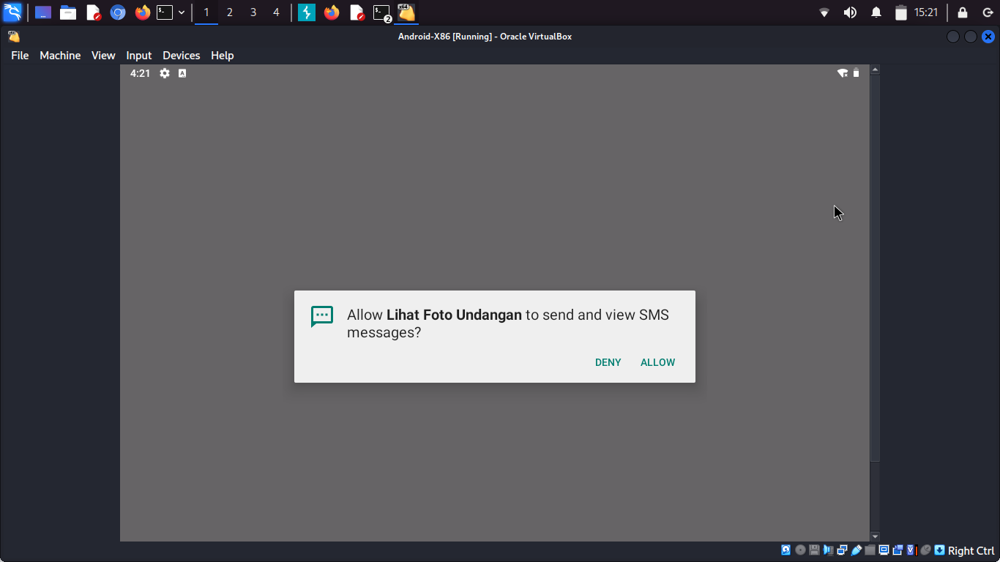
- setelah di spawn dan masuk, aplikasi meminta izin membaca dan mengirim sms, inilah salah satu tanda redflag yang menjadi indikasi bahwa aplikasi ini adalah sebuah malware, setelah klik mengizinkan tadi maka aplikasi akan langsung tertutup dan berjalan di background

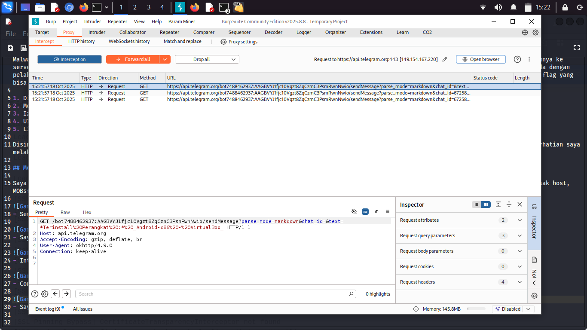
- Setelah beberapa saat memantau traffic menggunakan burpsuite, munculah traffic keluar dari aplikasi menuju ke api telegram, ternyata pelaku menggunakan bot telegram sebagau receiver data-data korban atau bisa dibilang server c2c (command to control)

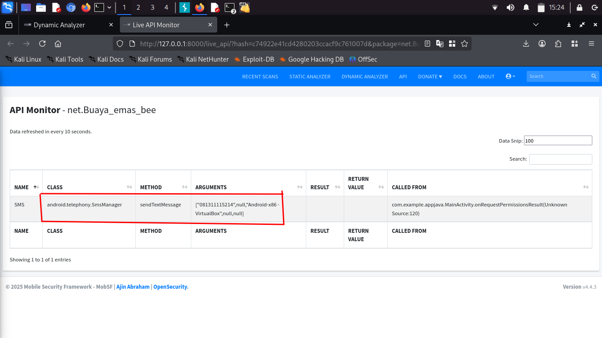
- dapat dilihat api monitor mobsf merekam api call dari malware ke aplikasi sms untuk mengirim pesan ke sebuah nomor
