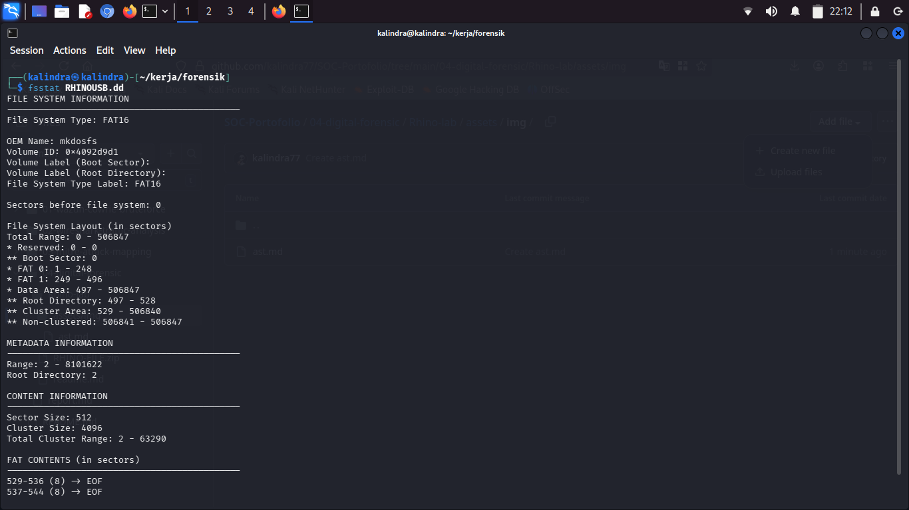
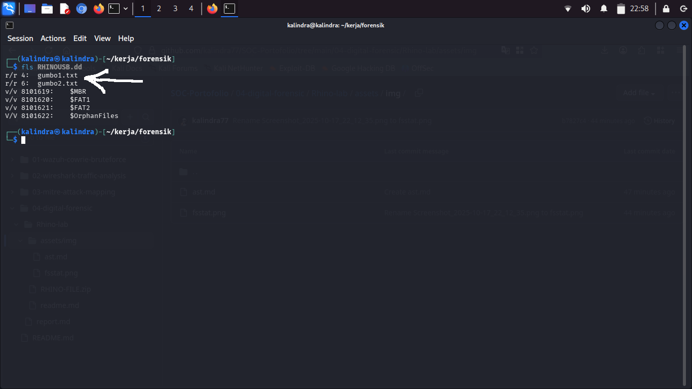
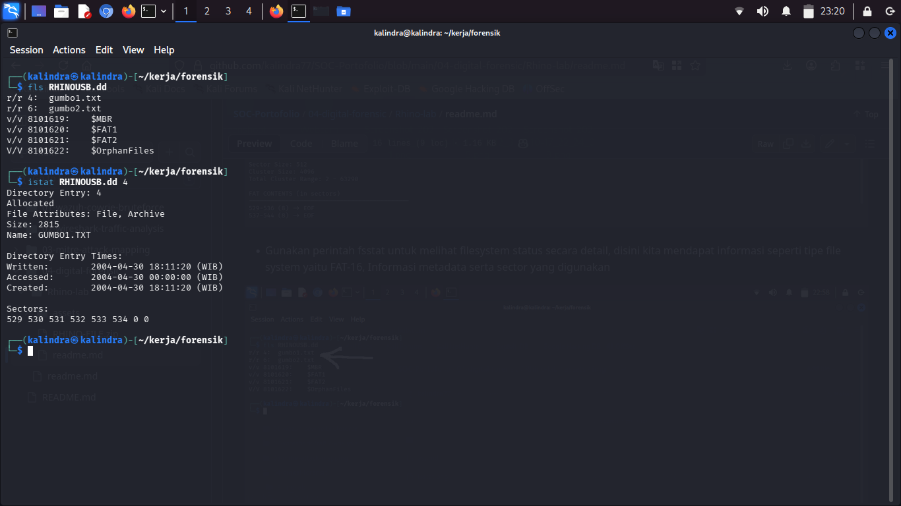
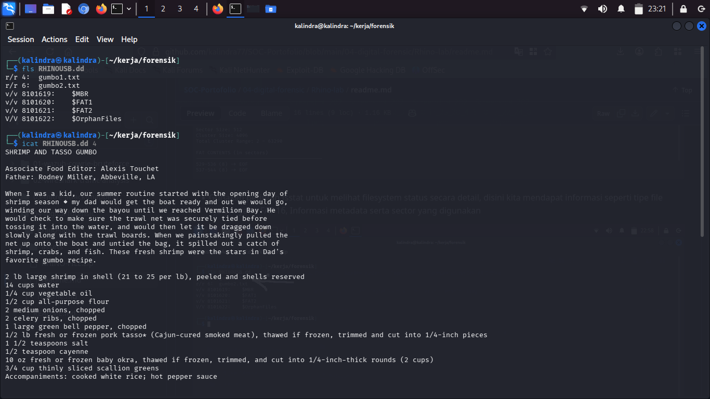
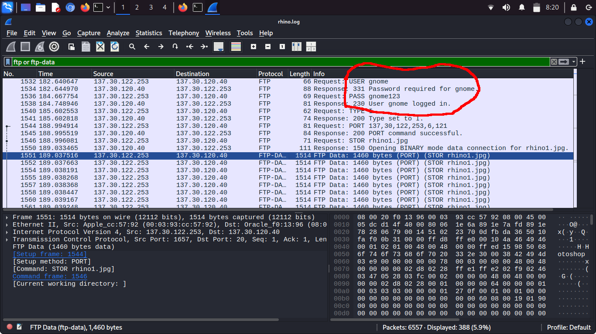
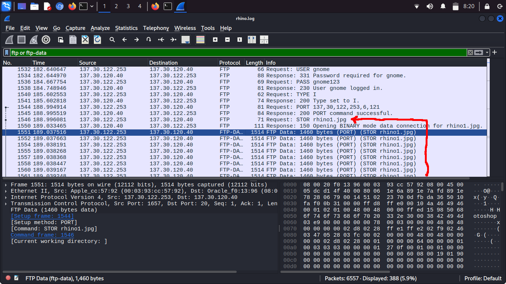
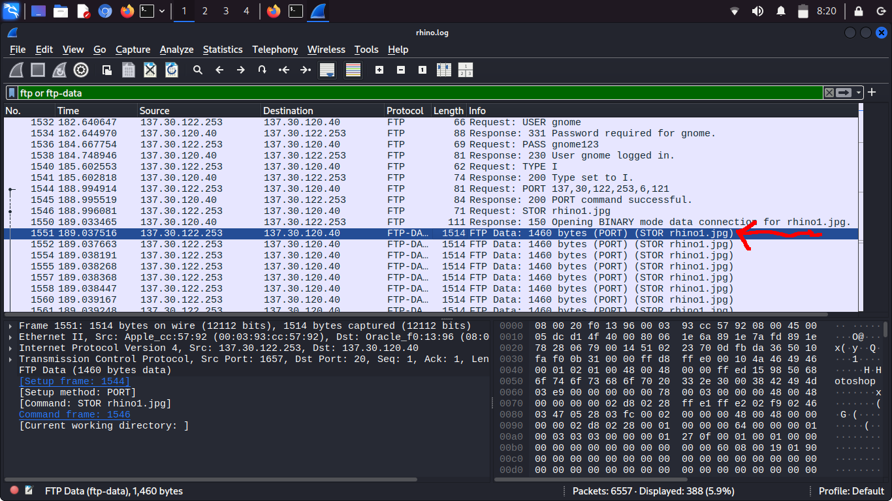
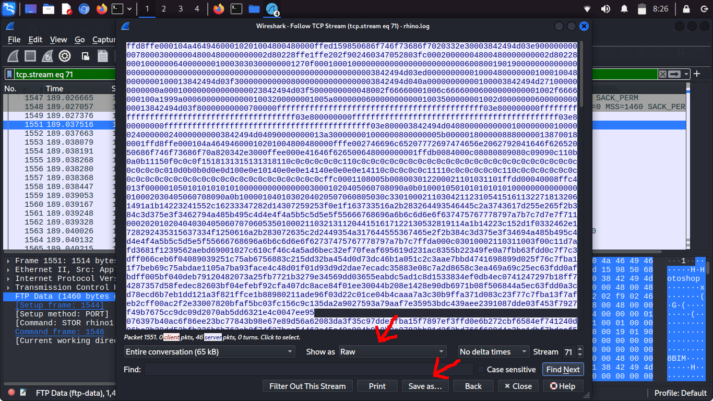
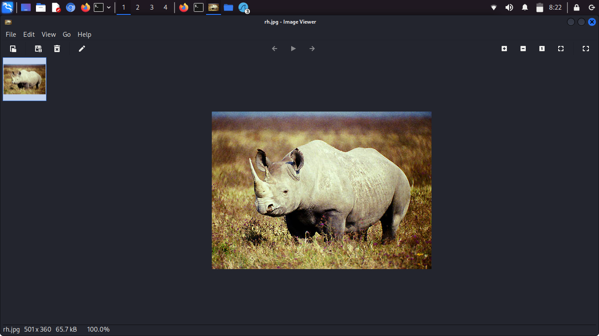

# Rhino Scenario

Disini saya menggunakan skenario rhino yang mana kita diberi tugas menganalisa dan mencari jejak pada file hasil dump yang telah diberikan untuk mengungkap sebuah kasus 

Tugasnya adalah memulihkan setidaknya sembilan gambar badak dari bukti yang tersedia dan memasukkannya ke dalam laporan singkat

• Siapa yang memberi terdakwa akun telnet/ftp?

• Apa nama pengguna/kata sandi untuk akun tersebut?

• Transfer berkas relevan apa yang muncul dalam jejak jaringan?

• Apa yang terjadi pada hard drive di komputer? Di mana sekarang?

• Apa yang terjadi pada key USB?

• Apa yang dapat dipulihkan dari image dd USB?

Apakah ada bukti yang menghubungkan kunci USB dan jejak jaringan? Jika ada, apa?

Saya akan coba menganalisa, mengidentifikasi, dan mencari bukti-bukti pada file RHINOUSB.dd dan traffic jaringan yang sudah ditangkap dalam bentuk bebrapa file log.

Saya Menggunakan tools yaitu autopsy dan the sleuth kit untuk menganalisa file dump usb juga Wireshark dan Bruteforcesharkcli untuk file log jaringannya

## Menganalisa dump usb menggunakan The sleuth kit

Pertama Saya akan menganalisa dump usb yang diberikan, bertujuan untuk mencari jejak dan bukti yang masih tersisa di usb, Disini saya hanya menggunakan The sleuth kit sebagai tools karena Autopsy sendiri hanya mempermudah menggunakan GUI yang pada dasarnya menggunakan TSK juga dibelakangnya.

- Gunakan perintah **fsstat** untuk melihat filesystem status secara detail, disini kita mendapat informasi seperti tipe file system yaitu FAT-16, Informasi metadata serta sector yang digunakan

- Gunakan perintah **fls** untuk meihat isi dari dump usb, tampak ada dua file pada gambar yaitu gumbo1.txt dengan inode 4 dan gumbo2.txt dengan inode 6. Dalam beberapa kasus file di dalam dump sudah dihapus untuk melihat file yang telah dihapus dapat menggunakan flag -d pada perintah menjadi fls -d juga flag -r untuk menampilkan file secara recursive

- Gunakan perintah **istat** ditambah inode yang sudah didapat untuk melihat status inode dari sebuah file. Disini kita dapat melihat informasi detail file tersebut mulai dari size, nama, metadata waktu dibuat, diakses dan terakhir ditulis hingga sektor mana saja yang digunakan oleh file tersebut

- Terakhir gunakan perintah **icat** beserta inode dari gumbo1.txt untuk menampilkan isinya. Jika ingin menyimpan hasilnya bisa gunakan > menjadi icat RHINOUSB.dd 4 > nama_file 

Tampaknya isi dump usb hanya berupa file teks resep masakan,tidak ada bukti apun yang mencurigakan dan mengarah ke tindakan kriminal.

## Menganalisa file log network traffic menggunakan Wireshark

Selanjutnya setelah menganalisa dump usb, ternyata tidak ditemukan hal-hal yang mencurigakan, dalam file zip ini ada 3 buah log file yang berisi log traffic jaringan, untuk melanjutkan investigasi saya menggunakan wireshark untuk menganalisa log traffic ini

- Buka file dengan wireshark lalu gunakan filter **ftp or ftp-data** untuk melihat lalu lintas ftp pada log, dapat dilihat di atas ada user dan password ftp yang tidak terenkripsi pertanyaan username dan password terjawab username: gnome password: gnome123

- Bisa dilihat ada traffic pengiriman data melalui ftp dengan nama file rhino1.jpg, kita bisa merocevery file tersebut dengan melihat raw data nya

- Kita bisa melihat aliran data nya Dengan klik kanan pada log pertama pengriman lalu follow pilih TCP stream untuk melihat aliran data dan isi raw nya

- Di sini jika data berupa ASCII pada kolom show as ubah menjadi RAW lalu klik save as masukan nama file untuk disimpan

- Hasilnya adalah file rhino1 yang berhasil di recover, gambar menunjukan seekor badak di alam liar
