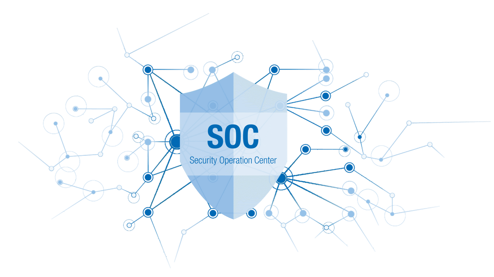

  

# SOC Analyst Portfolio

Kumpulan proyek investigasi dan analisis insiden keamanan siber berbasis log, traffic, dan deteksi ancaman.

## 🔧 Tools yang Digunakan
- Wazuh (SIEM)
- Cowrie (Honeypot)
- Suricata (IDS)
- Mobsf (Mobile security framework)
- Metasploit Framework
- Wireshark
- The Sleuth Kit
- Autopsy
- Volatility
- Virustotal
- MITRE ATT&CK

## 🧠 Skills
- Log analysis
- Digital Forensic
- Incident detection & response
- Threat intelligence mapping
- Network analysis (TCP/IP, DNS, HTTP, SSH)
- Basic android malware analysis 
- Education and prevention of phishing and fraud

## 📂 Projects
| Project | Deskripsi
|----------|------------|
| [SOC-lab](01-soc-lab) | Lab Security Operation Center
| [Digital Forensic](02-digital-forensic) | Analisis digital forensik dari hasil insiden
| [Android Malware analysis](03-android-malware-analysis) | Analisis android malware
| [Phising and Fraud](04-phising-and-fraud) | Phising dan Fraud
